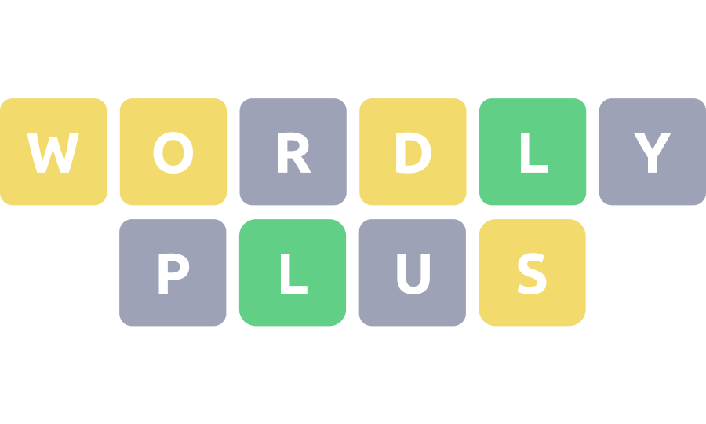
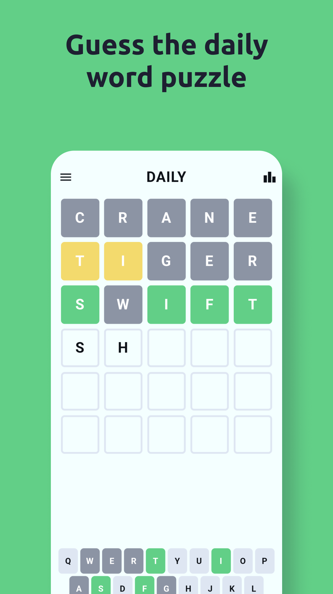
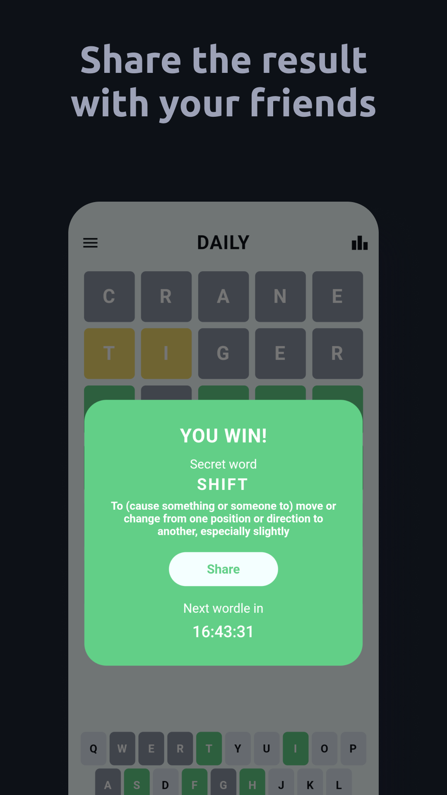
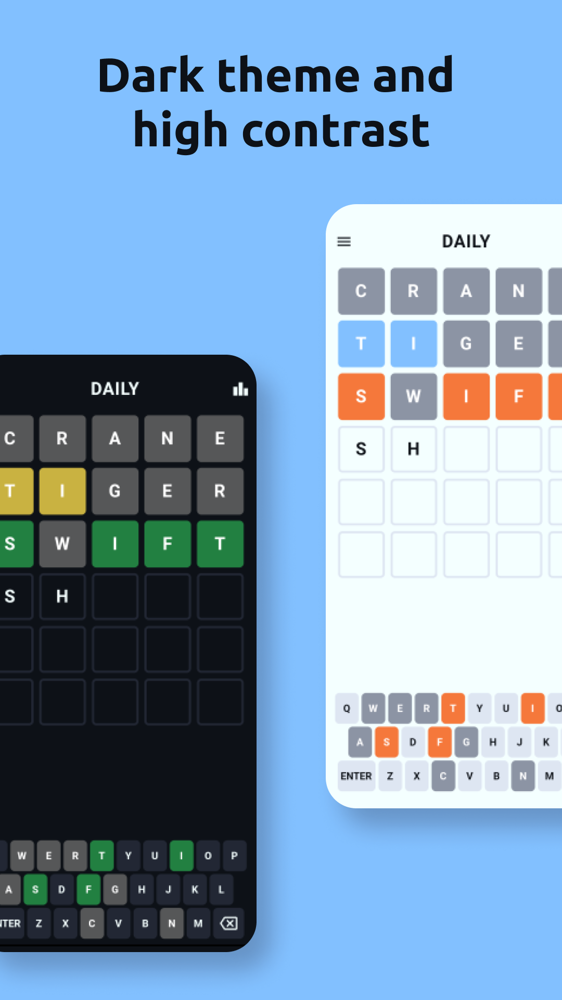
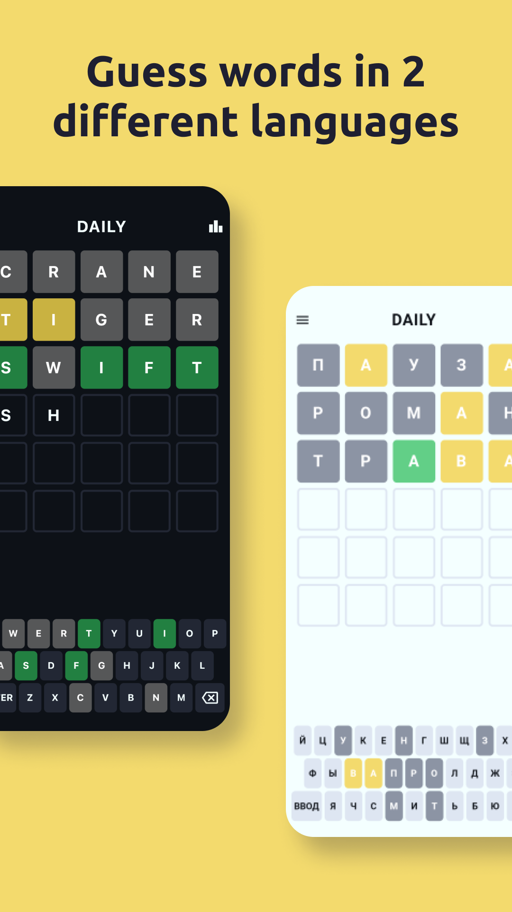

# Guess the **WORD** in six tries

Have 2 dictionary languages
- RU  - [Dictionary scraper](https://github.com/Carapacik/gufo-me-dictionary-scraper)
- EN  - [Dictionary scraper](https://github.com/Carapacik/cambridge-dictionary-scraper)

Have 2 game modes:
- Daily (default)
- Level

 
 
